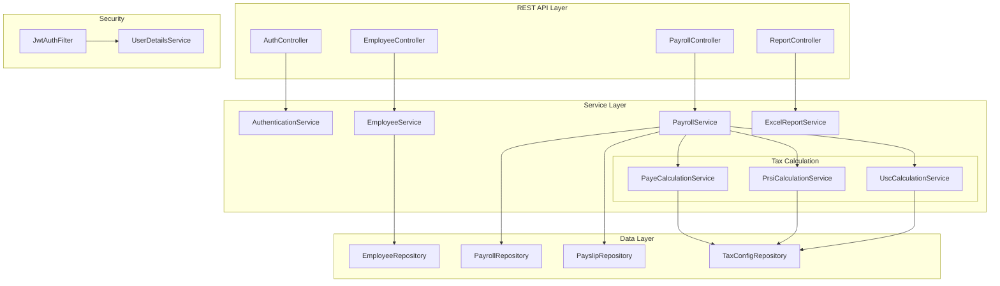
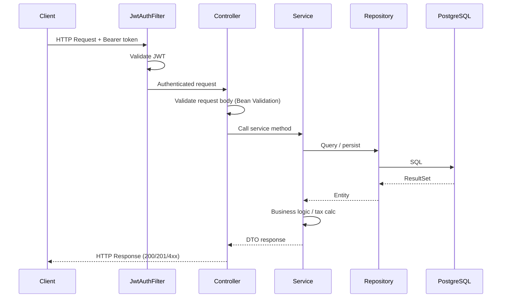

# Project Structure

## Overview
The Irish Payslips Management System follows a layered architecture pattern with clear separation of concerns. The project structure is organized around Spring Boot conventions with additional layers for Irish payroll-specific functionality.

## Architecture Diagram



## Request Flow



## Directory Structure
```
irish-payslips-management/
├── src/
│   ├── main/
│   │   ├── java/com/irish/payroll/
│   │   │   ├── IrishPayrollApplication.java
│   │   │   ├── config/                    # Configuration classes
│   │   │   │   ├── SecurityConfig.java
│   │   │   │   ├── DatabaseConfig.java
│   │   │   │   └── ApplicationConfig.java
│   │   │   ├── controller/                # REST API controllers
│   │   │   │   ├── PayrollController.java
│   │   │   │   ├── EmployeeController.java
│   │   │   │   ├── PayslipController.java
│   │   │   │   └── AuthController.java
│   │   │   ├── service/                   # Business logic layer
│   │   │   │   ├── PayrollService.java
│   │   │   │   ├── EmployeeService.java
│   │   │   │   ├── PayslipService.java
│   │   │   │   ├── tax/                   # Irish tax calculation services
│   │   │   │   │   ├── PayeCalculationService.java
│   │   │   │   │   ├── PrsiCalculationService.java
│   │   │   │   │   ├── UscCalculationService.java
│   │   │   │   │   └── TaxCreditService.java
│   │   │   │   └── pdf/                   # PDF generation services
│   │   │   │       ├── PayslipPdfService.java
│   │   │   │       └── P60PdfService.java
│   │   │   ├── repository/                # Data access layer
│   │   │   │   ├── EmployeeRepository.java
│   │   │   │   ├── PayrollRepository.java
│   │   │   │   ├── PayslipRepository.java
│   │   │   │   └── TaxConfigRepository.java
│   │   │   ├── entity/                    # JPA entities
│   │   │   │   ├── Employee.java
│   │   │   │   ├── Payroll.java
│   │   │   │   ├── Payslip.java
│   │   │   │   ├── TaxConfiguration.java
│   │   │   │   └── AuditableEntity.java
│   │   │   ├── dto/                       # Data Transfer Objects
│   │   │   │   ├── request/
│   │   │   │   │   ├── EmployeeCreateRequest.java
│   │   │   │   │   ├── PayrollRunRequest.java
│   │   │   │   │   └── PayslipRequest.java
│   │   │   │   └── response/
│   │   │   │       ├── EmployeeResponse.java
│   │   │   │       ├── PayslipResponse.java
│   │   │   │       └── TaxCalculationResponse.java
│   │   │   ├── mapper/                    # Object mapping
│   │   │   │   ├── EmployeeMapper.java
│   │   │   │   ├── PayrollMapper.java
│   │   │   │   └── PayslipMapper.java
│   │   │   ├── validation/                # Custom validators
│   │   │   │   ├── PpsNumberValidator.java
│   │   │   │   ├── IrishBankAccountValidator.java
│   │   │   │   └── ValidPpsNumber.java
│   │   │   ├── exception/                 # Exception handling
│   │   │   │   ├── GlobalExceptionHandler.java
│   │   │   │   ├── PayrollException.java
│   │   │   │   ├── EmployeeNotFoundException.java
│   │   │   │   └── TaxCalculationException.java
│   │   │   ├── security/                  # Security components
│   │   │   │   ├── JwtAuthenticationFilter.java
│   │   │   │   ├── UserDetailsServiceImpl.java
│   │   │   │   └── SecurityUtils.java
│   │   │   └── util/                      # Utility classes
│   │   │       ├── DateUtils.java
│   │   │       ├── CurrencyUtils.java
│   │   │       └── IrishTaxConstants.java
│   │   └── resources/
│   │       ├── application.yml
│   │       ├── application-dev.yml
│   │       ├── application-test.yml
│   │       ├── application-prod.yml
│   │       ├── db/migration/              # Liquibase migrations
│   │       │   ├── V1__create_employees_table.sql
│   │       │   ├── V2__create_payroll_tables.sql
│   │       │   ├── V3__create_tax_configuration.sql
│   │       │   └── V4__insert_irish_tax_rates.sql
│   │       ├── templates/                 # Email templates
│   │       │   ├── payslip-email.html
│   │       │   └── password-reset.html
│   │       └── static/                    # Static resources
│   │           ├── css/
│   │           ├── js/
│   │           └── images/
│   └── test/
│       ├── java/com/irish/payroll/
│       │   ├── controller/                # Controller tests
│       │   │   ├── PayrollControllerTest.java
│       │   │   ├── EmployeeControllerTest.java
│       │   │   └── PayslipControllerTest.java
│       │   ├── service/                   # Service tests
│       │   │   ├── PayrollServiceTest.java
│       │   │   ├── tax/
│       │   │   │   ├── PayeCalculationServiceTest.java
│       │   │   │   ├── PrsiCalculationServiceTest.java
│       │   │   │   └── UscCalculationServiceTest.java
│       │   │   └── pdf/
│       │   │       └── PayslipPdfServiceTest.java
│       │   ├── repository/                # Repository tests
│       │   │   ├── EmployeeRepositoryTest.java
│       │   │   └── PayrollRepositoryTest.java
│       │   ├── integration/               # Integration tests
│       │   │   ├── PayrollIntegrationTest.java
│       │   │   └── DatabaseIntegrationTest.java
│       │   └── util/                      # Test utilities
│       │       ├── TestDataBuilder.java
│       │       └── PayrollTestUtils.java
│       └── resources/
│           ├── application-test.yml
│           ├── test-data.sql
│           └── fixtures/
│               ├── employee-data.json
│               └── payroll-data.json
├── .ai-rules/                             # AI guidance files
│   ├── product.md
│   ├── tech.md
│   └── structure.md
├── docker/
│   ├── Dockerfile
│   ├── docker-compose.yml
│   └── docker-compose.dev.yml
├── docs/                                  # Documentation
│   ├── api/
│   │   └── payroll-api.md
│   ├── setup/
│   │   └── development-setup.md
│   └── irish-tax-requirements.md
├── pom.xml
├── README.md
├── .gitignore
└── .env.example
```

## Architectural Layers

### 1. Controller Layer (`controller/`)
- REST API endpoints
- Request validation
- Response formatting
- HTTP status code management
- API documentation with OpenAPI annotations

### 2. Service Layer (`service/`)
- Business logic implementation
- Transaction management
- Irish tax calculations
- PDF generation
- Email services

### 3. Repository Layer (`repository/`)
- Data access abstraction
- JPA repository interfaces
- Custom query methods
- Database interaction

### 4. Entity Layer (`entity/`)
- JPA entity definitions
- Database table mappings
- Relationship definitions
- Audit trail support

### 5. Security Layer (`security/`)
- Authentication logic
- Authorization rules
- JWT token handling
- Role-based access control

## Naming Conventions

### Package Naming
- Use reverse domain notation: `com.irish.payroll.*`
- Keep package names lowercase
- Use descriptive package names that reflect functionality

### Class Naming
- **Controllers**: `*Controller.java` (e.g., `PayrollController.java`)
- **Services**: `*Service.java` (e.g., `PayrollService.java`)
- **Repositories**: `*Repository.java` (e.g., `EmployeeRepository.java`)
- **Entities**: Plain nouns (e.g., `Employee.java`, `Payslip.java`)
- **DTOs**: `*Request.java` or `*Response.java`
- **Exceptions**: `*Exception.java`
- **Validators**: `*Validator.java`

### File Organization Rules

#### Configuration Files
- Place all configuration classes in `config/` package
- Use `@Configuration` annotation
- Name with `Config` suffix

#### Test Files
- Mirror the main package structure in test directory
- Test classes should end with `Test.java`
- Integration tests go in `integration/` package
- Use `TestDataBuilder` pattern for test data creation

#### Resource Files
- Database migrations in `db/migration/` with versioned naming
- Templates in `templates/` directory
- Static resources in `static/` with subdirectories for type

## Irish Payroll Specific Structure

### Tax Calculation Services (`service/tax/`)
- Separate service for each tax type (PAYE, PRSI, USC)
- Tax configuration management
- Year-over-year tax rule changes
- Tax credit calculations

### Validation (`validation/`)
- Irish-specific validators (PPS number, bank account)
- Custom validation annotations
- Validation groups for different scenarios

### Constants (`util/`)
- Irish tax rates and bands
- Currency formatting
- Date formatting for Irish compliance
- Error messages and codes

## Development Guidelines

### Adding New Features
1. Start with entity design in `entity/` package
2. Create repository interface in `repository/`
3. Implement business logic in `service/`
4. Add REST endpoints in `controller/`
5. Create DTOs in appropriate `dto/` subpackage
6. Add comprehensive tests

### Code Organization Principles
- Single Responsibility Principle per class
- Clear separation between layers
- No circular dependencies between packages
- Use dependency injection throughout
- Follow Spring Boot conventions

### Testing Strategy
- Unit tests for all service layer components
- Integration tests for repository layer
- Controller tests with MockMvc
- End-to-end tests for critical payroll workflows
- Test data builders for complex object creation