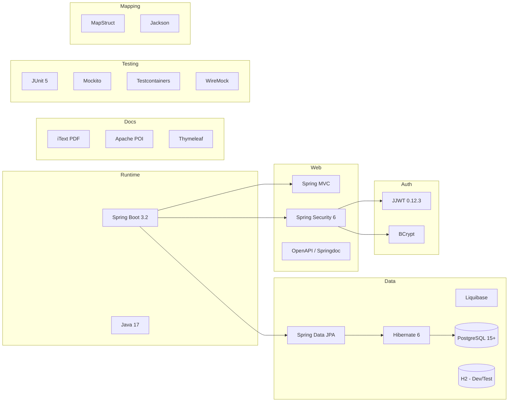

# Technology Stack

## Core Framework
- **Spring Boot 3.2.x**: Main application framework
- **Java 17**: Programming language (LTS version)
- **Maven 3.9.x**: Build tool and dependency management

## Web Layer
- **Spring Web MVC**: REST API development
- **Spring Security 6.x**: Authentication and authorization
- **Spring Validation**: Input validation with Bean Validation (JSR-303)
- **OpenAPI 3 (Springdoc)**: API documentation and Swagger UI

## Data Layer
- **Spring Data JPA**: Database abstraction layer
- **Hibernate 6.x**: ORM implementation
- **PostgreSQL 15+**: Primary database (recommended for production)
- **H2 Database**: In-memory database for testing
- **Liquibase**: Database migration and versioning

## Security & Authentication
- **Spring Security**: Core security framework
- **JWT (JSON Web Tokens)**: Stateless authentication
- **BCrypt**: Password hashing
- **HTTPS/TLS**: Encrypted communication

## Testing Framework
- **JUnit 5**: Unit testing framework
- **Mockito**: Mocking framework
- **Spring Boot Test**: Integration testing
- **Testcontainers**: Database integration testing
- **WireMock**: External service mocking

## Documentation & Reporting
- **iText PDF**: Payslip PDF generation
- **Apache POI**: Excel report generation
- **Thymeleaf**: Email template processing
- **Spring Mail**: Email service integration

## Monitoring & Observability
- **Spring Boot Actuator**: Application monitoring endpoints
- **Micrometer**: Metrics collection
- **Logback**: Logging framework
- **SLF4J**: Logging facade

## Development Tools
- **Spring Boot DevTools**: Development-time features
- **Maven Wrapper**: Consistent Maven version
- **Git**: Version control
- **Docker**: Containerization support

## External Dependencies
- **Jackson**: JSON processing
- **MapStruct**: Bean mapping
- **Apache Commons**: Utility libraries
- **Caffeine**: Caching framework

## Build and Deployment
```xml
<!-- Key Maven dependencies -->
<dependency>
    <groupId>org.springframework.boot</groupId>
    <artifactId>spring-boot-starter-web</artifactId>
</dependency>
<dependency>
    <groupId>org.springframework.boot</groupId>
    <artifactId>spring-boot-starter-data-jpa</artifactId>
</dependency>
<dependency>
    <groupId>org.springframework.boot</groupId>
    <artifactId>spring-boot-starter-security</artifactId>
</dependency>
<dependency>
    <groupId>org.springframework.boot</groupId>
    <artifactId>spring-boot-starter-validation</artifactId>
</dependency>
```

## Testing Commands
```bash
# Run all tests
mvn test

# Run integration tests
mvn verify

# Generate test coverage report
mvn jacoco:report

# Run specific test class
mvn test -Dtest=PayrollServiceTest
```

## Build Commands
```bash
# Clean and compile
mvn clean compile

# Package application
mvn clean package

# Run application locally
mvn spring-boot:run

# Build Docker image
docker build -t irish-payslips .
```

## Database Configuration
- **Development**: H2 in-memory database
- **Testing**: Testcontainers PostgreSQL
- **Production**: PostgreSQL with connection pooling (HikariCP)

## Environment Profiles
- **dev**: Development environment with debug logging
- **test**: Testing environment with test database
- **prod**: Production environment with optimized settings

## Irish-Specific Considerations
- **Currency**: Euro (EUR) with appropriate decimal precision
- **Date Formats**: DD/MM/YYYY format for Irish compliance
- **PPS Number Validation**: Custom validator for Irish Personal Public Service numbers
- **Revenue Integration**: Prepared for future Revenue Online Service (ROS) integration

## Technology Dependency Map



## Performance Requirements
- **Response Time**: < 200ms for payslip generation
- **Throughput**: Support 1000+ employees per payroll run
- **Concurrent Users**: Support 100 concurrent user sessions
- **Database**: Optimized queries with proper indexing

## Security Standards
- **OWASP**: Follow OWASP Top 10 security guidelines
- **GDPR**: Implement data protection and privacy controls
- **Encryption**: AES-256 for sensitive data at rest
- **Session Management**: Secure session handling with timeouts