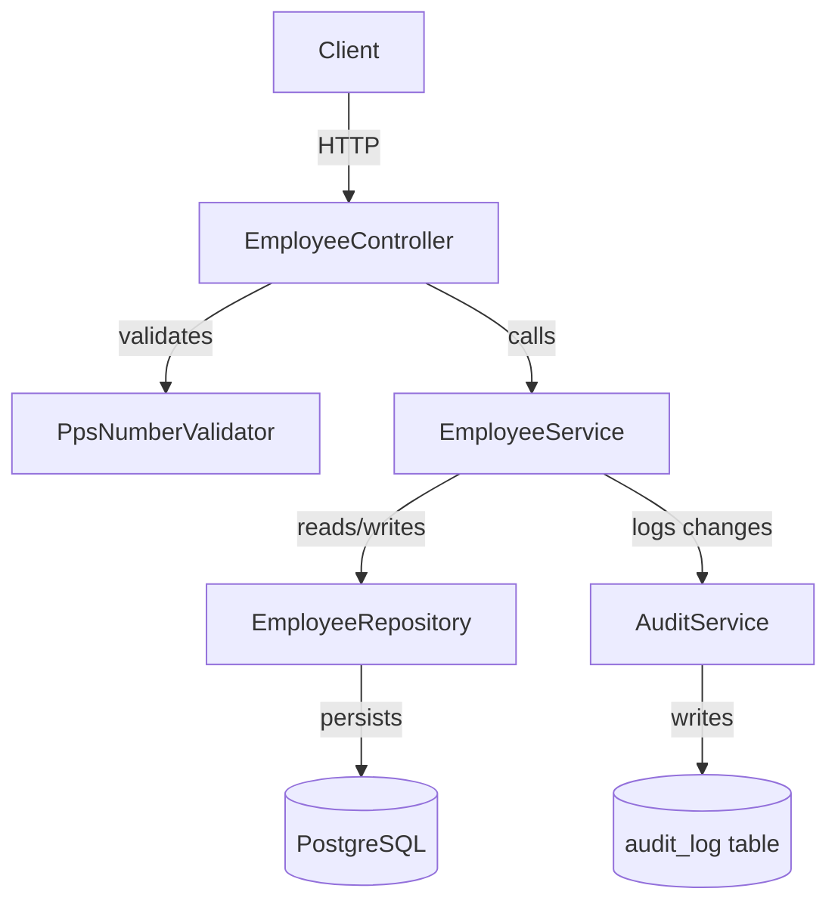
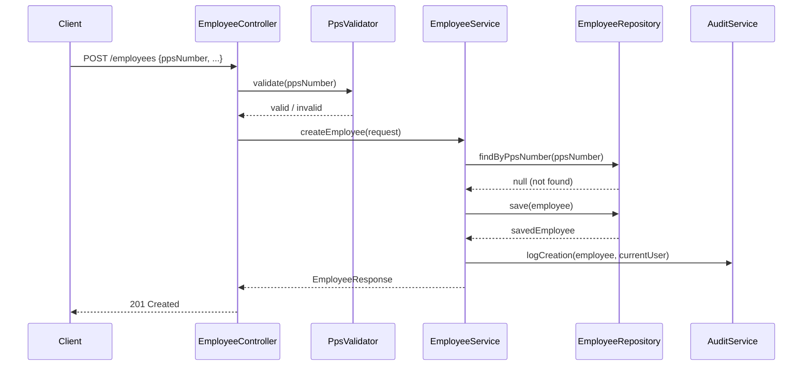

# Spec 001: Employee Management — Design

**Status**: ✅ Approved
**Depends on**: requirements.md ✅

---

## Component Architecture



---

## API Design

```
POST   /api/v1/employees          → Create employee
GET    /api/v1/employees          → List (paginated, filtered)
GET    /api/v1/employees/{id}     → Get by ID
PUT    /api/v1/employees/{id}     → Full update
PATCH  /api/v1/employees/{id}     → Partial update (tax credits etc.)
DELETE /api/v1/employees/{id}     → Soft delete (terminate)
GET    /api/v1/employees/{id}/audit → Audit trail for employee
```

---

## Data Flow



---

## Database Schema

```sql
-- employees table
CREATE TABLE employees (
    id           UUID PRIMARY KEY DEFAULT gen_random_uuid(),
    pps_number   VARCHAR(10) NOT NULL UNIQUE,  -- encrypted
    first_name   VARCHAR(100) NOT NULL,
    last_name    VARCHAR(100) NOT NULL,
    email        VARCHAR(255),
    department   VARCHAR(100),
    pay_frequency ENUM('WEEKLY','BIWEEKLY','MONTHLY') NOT NULL,
    tax_credit   DECIMAL(10,2) NOT NULL DEFAULT 3550.00,
    prsi_class   VARCHAR(5) NOT NULL DEFAULT 'A1',
    status       ENUM('ACTIVE','TERMINATED','ON_LEAVE') DEFAULT 'ACTIVE',
    start_date   DATE NOT NULL,
    terminated_at TIMESTAMP,
    created_at   TIMESTAMP DEFAULT now(),
    updated_at   TIMESTAMP DEFAULT now(),
    created_by   VARCHAR(100),
    updated_by   VARCHAR(100)
);
```

---

## Key Design Decisions

1. **UUID primary keys** — avoids enumeration attacks on employee IDs
2. **Soft delete** — `terminated_at` timestamp preserves payslip history
3. **Encrypted PPS** — AES-256 at application layer, not just DB-level
4. **Audit via service** — AuditService is explicit, not magic (no Hibernate Envers)
5. **Separate PATCH for tax credits** — avoids accidental overwrites of sensitive fields
